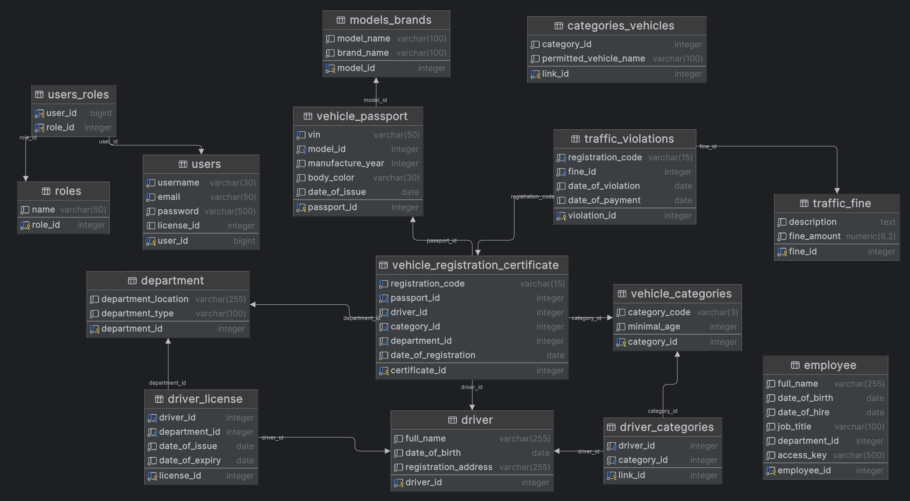

# Информационная система для учета транспортных средств и нарушений
> Проект был создан в контексте курсовой работы по дисциплине "Базы Данных" (2024-2025)

## Цель проекта
Целью данного проекта является разработка информационной системы, которая позволит автоматизировать процессы обработки и хранения данных, связанных с деятельностью госавтоинспекции.

## Внешняя модель
С точки зрения проектирования базы данных, в данной предметной области имеются следующие конечные пользователи: 
- Сотрудники ГИБДД
- Участники дорожного движения, то есть водители.

Опишем сущности предметной области:

| № |	Название | Назначение |
|---|----------|------------|
| 1	|Сотрудники ГИБДД|Описание состава сотрудников ГИБДД|
| 2	|Подразделения ГИБДД|Описание всех подразделений Ростовской области|
| 3	|Водители ТС|Данные о всех зарегистрированных участниках дорожного движения|
| 4	|Водительские удостоверения|Данные водительских удостоверений, зарегистрированных в ГИБДД|
| 5	|Категории ТС|Все категории транспортных средств, в зависимости от вида ТС|
| 6	|Паспорта ТС|Список всех паспортов ТС, прикрепленных к зарегистрированным ТС|
| 7	|Свидетельства о регистрации ТС|Список всех СТС, зарегистрированных в ГИБДД|
| 8	|Штрафы|Все категории штрафов|

### Объектно-реляционная схема сущностей


## База данных
Базой данных проекта была выбрана `PostgreSQL 16`, как надежная, быстрая и гибкая база хранения необходимой информации.
Для БД были введены ограничения целостности, таким образом, пользователь никаким образом не может нарушить структуру БД.



## Техническая реализация
- `Spring Boot` - автоматическую конфигурацию и модульность;
- `Spring Data` - упрощение взаимодействия с PostgreSQL;
  
  > Все SQL-запросы написаны вручную. Каждый модуль базы данных реализован в виде отдельного репозитория с кастомизированными методами. Это обеспечивает высокую производительность запросов и гибкость при работе с данными.
- `Spring Security` - система аутентификации поддерживает два типа пользователей: сотрудник ГИБДД и пользователь, с четким разграничением прав доступа. 

> [!NOTE]
> Пароли хранятся в зашифрованном виде с использованием алгоритма `BCrypt`, что добавляет дополнительный уровень безопасности.
- Визуальная часть приложения реализована с помощью `Thymeleaf`, который используется для создания HTML-шаблонов.
- С помощью библиотеки `iTextPDF` реализована генерация отчетов, которая применяется для создания документов в формате PDF, содержащих детализированную информацию о сущностях предметной области. Сформированные отчеты отправляются в ответ на запросы от сервера в формате application/pdf.

- Для хранения данных используется база данных `PostgreSQL`, обеспечивающая надежность и производительность.

## Демонстрация работы
### Главная страница

### Страница регистрации

### Панель водителя

### Панель сотрудника ГИБДД


## Развертка приложения на локальной машине
> [!NOTE]
> Для развертки приложения на локальном хосте будет использован Docker.

Требования к запуску приложения:
- Установленный Docker Desktop (необходим для фонового процесса)
### Инструкция к запуску
1. Через git bash скачайте репозиторий в нужную папку
```powershell
git clone https://github.com/duahifnv/TrafficInspectionApp.git
```
2. Переместитесь в папку с проектом
```powershell
cd TrafficInspection
```
3. Запустите необходимые контейнеры (База данных и приложение)
```powershell
docker-compose up
```
> [!IMPORTANT]
> Используйте файл `docker-compose.yml`, чтобы изменить конфигурацию контейнеров
4. Перейдите по адресу `<hostname>:8081`, чтобы попасть на главную страницу приложения (вместо hostname адрес вашего локального хоста - `localhost` по умолчанию)
